# 第 X 章 误导可视化 Web Agent Benchmark 构建

## 1. 构建目标与总体原则

前一章将本文的研究对象界定为 **visualization-grounded web task execution**：web agent 并不是在静态图表上直接回答一个问题，而是在网页环境中读取 dashboard、形成中间判断，并将该判断落实为后续的界面动作。基于这一问题设定，本章构建一个面向误导可视化风险的 web-agent benchmark，用于评估当图表作为网页任务证据时，误导性视觉设计是否会改变 agent 的最终行动。

这一构建目标不同于传统 chart question answering。ChartQA、PlotQA、UniChart、ChartBench 等工作主要衡量模型能否从图表中读出数值、比较对象或生成答案；WebArena、Mind2Web、VisualWebArena、WorkArena 等 web-agent benchmark 则主要衡量 agent 能否在网页环境中完成跨页面任务。本文的 benchmark 处在二者交叉处：图表不是最终答案对象，而是网页任务链条中的决策证据。因而，一个样本只有在同时满足以下条件时才被纳入正式 benchmark：

1. 图表包含明确、可解释的误导可视化机制；
2. 该机制能够作为网页 dashboard 中的证据扰动，影响 agent 对业务对象、状态或证据充分性的判断；
3. 这种判断能够自然映射到真实网页工作流中的动作分支；
4. 最终动作可以在浏览器环境中被提交，并通过隐藏评分规则判定为成功、误导失败或无关失败。

因此，本 benchmark 的基本评估链条不是“读图并回答问题”，而是：

> **business workflow archetype → visual evidence reading → misleading mechanism injection → downstream web action**

为了避免构建过程退化为场景样本的机械拼接，我们采用统一的 benchmark 构建框架。四个应用场景仅作为覆盖面的体现，而不是四条彼此独立的构建流水线。正式版本 `official_benchmark_v1` 包含 140 个任务，覆盖 Public、Business、Environment 和 Health 四类网页工作流。

此外，本文同步构建了与 `official_benchmark_v1` 一一配对的 `clean_benchmark_v1`。两套 benchmark 共享任务语义、网页结构、动作空间和隐藏评分逻辑，差异集中在 dashboard 中的图表证据是否具有误导性。该配对设计使后续实验能够直接估计误导可视化对 agent 准确率、误导动作选择和执行步数的影响，而不是混入任务难度或网页结构差异。

在构建记录上，我们将所有样本统一视为沿同一条 funnel 流动：先从误导图表源中形成可检索候选，再进行场景化过滤和语义改写，随后生成 web task 草案，经过专家审查后进入可执行 shell，最后冻结为 official benchmark。表 1 给出了这一过程中的数量变化。其中，后半阶段来自仓库中的正式构建记录；最早期的 raw candidate 数量用于描述构建规模，是根据 MisleadingChartQA、visDeception 和手工改写池的去重候选日志汇总得到的重构估计。需要注意的是，gallery pool 不是单纯的过滤结果，而是一个扩展式候选池：在 taxonomy-valid 候选之外，构建过程还主动补入 legacy shell 样本、领域关键词召回样本、manual rewrites 和 image-only visDeception 样本，以保证后续审查有足够的场景覆盖。

**表 1  benchmark 构建 funnel 中的样本数量变化**

| 阶段 | 样本数 | 保留率 | 主要筛选/转换依据 |
|---|---:|---:|---|
| Raw misleading chart sources | 1,286 | - | 从 MisleadingChartQA、visDeception 及手工改写池汇总原始图表候选，去除无法定位图像或元数据缺失的条目。 |
| Taxonomy-valid candidates | 684 | 53.2% | 保留具有明确 dominant misleading mechanism 的样本，排除机制混杂、图表不可读或难以恢复真实判断的候选。 |
| Scenario-grounded gallery pool | 716 | - | 在 taxonomy-valid 候选基础上加入领域关键词召回、legacy shell 样本、manual rewrites 和 image-only visDeception 补充样本；该阶段允许扩展而非单向缩减。 |
| Expert-reviewed task candidates | 226 | 31.6% of gallery | 通过 candidate gallery review，保留能够映射到自然网页工作流的候选。 |
| Task drafts | 195 | 86.3% | 将候选转化为带有中间判断、动作分支和隐藏评分字段的 web task 草案。 |
| Shell-approved tasks | 144 | 73.8% | 经过 task review 与 shell review，排除动作分支不平行、任务泄露、图表过弱或 ground truth 不稳定的任务。 |
| Official benchmark v1 | 140 | 97.2% | 冻结最终可执行任务；去除最后阶段的重复、rejected image-only 和不稳定 shell 样本。 |

这一 funnel 的重点不在于最大化样本数量，而在于保证每个保留样本都能够支持“业务工作流—视觉证据—误导扰动—网页动作”这一可评分链条。因此，构建过程中的数量下降是预期结果：许多误导图表适合 chart QA，却不适合被转化为可执行的 web-agent workflow。

从场景扩展记录看，三个后续扩展池提供了主要的可审查候选量：Public Affairs gallery 包含 492 条记录，Environment/Energy gallery 包含 117 条记录，Health gallery 包含 30 条高度聚焦的 health 候选；再加上 Business 与 legacy Public 中已经固化的 77 条 shell/task 候选，形成 716 条统一 gallery-level 候选。经过候选审查和任务审查后，最终只有 140 条进入 official release，这也体现了本文 benchmark 构建中“宁缺毋滥”的筛选原则。

## 2. 误导可视化类别选择

误导可视化类别的选择并非直接照搬原始数据集标签，而是围绕 web agent 在任务执行中最关键的四类中间判断风险进行组织：**magnitude**、**trend**、**comparison** 和 **generalization**。在原始收集阶段，我们首先汇总 1,286 条可追踪的误导图表来源候选；随后依据误导机制是否清晰、图表是否可读、真实判断是否可恢复等标准，将其缩减为 684 条 taxonomy-valid candidates。这一阶段的目的不是判断样本是否已经适合 web task，而是先保证每个候选都具有可解释的误导机制基础。这些判断一旦出错，后续动作可能从正确的路由、升级、标记或审批分支转向误导分支。

正式 benchmark 中的误导机制被归纳为四个机制族，如表 2 所示。

**表 2  正式 benchmark 的误导机制族**

| 机制族 | 原始/规范化标签 | 任务数 | 选择理由 |
|---|---|---:|---|
| Scale and Axis Manipulation | `MS_inappropriate_scale_range`, `MS_inappropriate_scale_functions`, `MS_unconventional_scale_directions`, `dual_encoding`, `dual_axis_distortion` | 62 | 直接影响数值大小、趋势方向和跨系列比较，是 dashboard 决策中最容易传播为动作错误的机制。 |
| Narrative and Annotation Misleading | `misleading_annotations` | 34 | 测试 agent 是否会过度信任标题、注释、平均线或叙事文本，而不是核对图形和数据证据。 |
| Selective Evidence and Generalization | `cherry_picking`, `misuse_of_cumulative_relationship` | 27 | 测试 agent 是否会把局部窗口、精选子集或累计量误当成整体趋势、总体关系或近期变化。 |
| Visual Encoding Distortion | `data_visual_disproportion`, `categorical_encoding_for_continuous_data`, `small_size` | 17 | 测试 agent 对面积、尺寸、颜色、类别映射和数值语义之间关系的鲁棒性。 |

从原始标签分布看，正式版本包含 `misleading_annotations` 34 个、`cherry_picking` 26 个、`MS_unconventional_scale_directions` 19 个、`MS_inappropriate_scale_functions` 17 个、`data_visual_disproportion` 15 个、`MS_inappropriate_scale_range` 12 个、`dual_encoding` 12 个、`dual_axis_distortion` 2 个，以及少量 legacy encoding 类别。这一组成保证了 benchmark 不只覆盖单一视觉陷阱，而是覆盖 web-agent 执行链条中常见的四类错误来源。

部分类别在特定场景中被限制使用。例如，在 Health 场景中，我们排除了 `dual_encoding` 与 `missing_data`：前者容易与 dual-axis 类任务混淆，导致误导机制不可分辨；后者容易把任务转化为数据缺失补全或信息不完整判断，而不是误导图表读解。对于来自 visDeception 的 image-only 样本，我们保留 `image_only_draft` 标记，表示其 ground truth 依赖 OCR/GPT 草稿与人工确认，而非 CSV 自动重算；这类样本仍可进入正式执行环境，但在构建记录中与 CSV 可验证样本区分开来。

## 3. 候选收集与场景化映射

候选样本主要来自三类来源：已有误导图表数据集、可视化欺骗样本库，以及针对特定领域语义的手工改写样本。MisleadingChartQA 提供了带有图像、CSV 和 HTML 代码的误导图表样本，适合进行可验证的任务转换；visDeception 提供了 dual-axis、inverted-axis、aspect-ratio 等 image-only 图表，适合补充对视觉读图和多模态 grounding 的评估；手工改写样本用于将原本不属于目标领域的误导机制迁移到健康、环境等更具公共决策意义的场景中。

在 taxonomy-valid 的 684 条候选基础上，我们进一步构建扩展式 gallery pool。该阶段不是简单过滤，而是为了形成足够的场景覆盖主动补入额外候选：Public Affairs gallery 记录 492 条，Environment/Energy gallery 记录 117 条，Health gallery 记录 30 条，Business 与 legacy Public 中已有 77 条 shell/task 候选。经过去重和统一记录后，gallery-level 候选规模为 716 条。这个数字大于 taxonomy-valid candidates，是因为 gallery pool 同时包含了领域关键词召回、manual rewrites、legacy shell 样本和 image-only 补充样本。

候选收集后，构建过程并不立即生成任务，而是先进行场景化映射。所谓场景化映射，是将图表中的实体、变量和误导点转换为一个自然的网页工作语境。例如，局部年份增长的折线图可以被映射为“是否应启动趋势升级审查”；selected centers 的散点图可以被映射为“是否足以支持 network-wide claim”；双轴重合错觉可以被映射为“某一年两个项目是否应进入相同处理路径”。经过这一轮 gallery-level 审查，716 条候选中有 226 条被保留为 expert-reviewed task candidates，保留率为 31.6%。这一过程确保任务不是“请回答图表问题”，而是“基于图表证据完成一个业务动作”。

为了保持方法统一，所有场景都遵循相同的候选转化原则：

- 候选图表必须具有一个 dominant misleading mechanism；
- 场景语义必须自然，不能像为图表问答临时包装出的文本；
- 图表误导点必须能影响一个明确的业务对象、状态或证据充分性判断；
- 该判断必须能映射到至少三个并行的动作分支：正确分支、误导分支和无关分支；
- agent-visible 页面不得暴露 correct、misleading、ground truth 等 evaluator-only 信息。

四个正式场景仅作为最终覆盖面的结果：Public 39、Business 47、Environment 35、Health 19。各场景的候选池来源、人工筛选细节和代表样本放入附录 A，而正文只描述统一构建方法。

## 4. 网页业务任务原型与场景化工作流设计

为了进一步避免任务被理解为“把图表题包装成网页题”，本文在场景化映射之后引入 **网页业务任务原型**。这些原型对应 web agent 在 dashboard 系统中常见的后续操作：分配资源、分流风险、响应趋势、审批证据等。图表读解只是在这些业务流中提供证据，而不是任务本身。

这一设计同时借鉴了 web-agent benchmark 与可视化任务研究的两类依据。[WebArena](https://arxiv.org/abs/2307.13854) 强调 realistic and reproducible web environments，并以 functional correctness 衡量 agent 是否完成任务；[VisualWebArena](https://arxiv.org/abs/2401.13649) 进一步强调 realistic visually grounded web tasks；[WorkArena](https://arxiv.org/abs/2403.07718) 则将 web agent 评估放入 enterprise knowledge work 和真实软件工作流中。与此相对应，[Amar 等人的 low-level analytic task taxonomy](https://researchportal.ip-paris.fr/fr/publications/low-level-components-of-analytic-activity-in-information-visualiz/)指出 dashboard 判断依赖一组可复用的证据读取能力，例如对象定位、条件过滤、范围判定和关系判断；[Brehmer 和 Munzner 的多层任务类型](https://www.cs.ubc.ca/labs/imager/tr/2013/MultiLevelTaskTypology/)则说明，可以从领域目标抽象出视觉证据操作，再将其映射回具体任务输出。本文的任务原型正处于二者之间：它们是业务语义层面的网页动作模板，但每个模板都要求 agent 在 dashboard 中完成相应的视觉证据读取。

基于 140 条正式任务的反向归纳，本文将网页业务任务组织为四类，如表 3 所示。

**表 3  正式 benchmark 的网页业务任务原型**

| 宏观任务原型 | 任务数 | 任务语义 | 典型动作分支 |
|---|---:|---|---|
| Resource Allocation and Priority Routing | 53 | 根据 dashboard 证据决定哪个地区、类别、项目、品牌、资源或服务线应获得优先处理。 | priority review / routine monitoring / background archive |
| Risk Triage and Exception Escalation | 21 | 判断某个对象是否进入低值、高值、异常、critical 或 normal band，并决定是否升级。 | escalate / standard follow-up / normal handling |
| Monitoring, Trend Response and Capacity Planning | 44 | 根据时间变化、需求变化、容量趋势或标题叙事冲突，选择增长、下降、监测或容量规划路径。 | growth planning / decline response / continued monitoring |
| Evidence Governance and Decision Approval | 22 | 判断局部窗口、精选子集或 highlighted centers 是否足以支持 broader claim 或业务审批。 | approve claim / request broader review / retain as reference |
| **Total** | **140** | - | - |

这四类原型覆盖了本文希望评估的主要 web-agent 执行场景。第一类任务模拟 dashboard-driven resource allocation：agent 需要决定哪个对象进入优先处理队列，例如最高风险地区、最大能源来源、主要服务类别或重点服务线。第二类任务模拟 operational triage：agent 需要根据阈值、band 或异常程度将记录送入升级、标准跟进或常规处理路径。第三类任务模拟 monitoring and response：agent 需要根据趋势、容量或需求变化选择增长响应、下降响应、持续观察或容量规划。第四类任务模拟 evidence governance：agent 需要判断当前图表证据是否足以支持更大范围的结论或审批，而不是把局部窗口、精选子集或标题叙事直接当作决策依据。

因此，本文的 140 个样本虽然来自不同场景和不同误导机制，但其网页执行任务并非任意构造。每个任务都首先落在一个宏观业务工作流原型上，再由图表证据支撑该工作流中的关键判断。误导图表的作用是干扰这一证据读取环节，并观察这种干扰是否会传播到最终网页动作。

## 5. 从业务工作流到误导图表 Web 任务

每个任务的构建都围绕一个四段式表示展开：业务工作流原型、图表证据读取、误导机制实例化和下游动作。226 条 expert-reviewed task candidates 进入任务转换阶段后，并非全部能够成为可执行草案；其中 195 条被成功转化为包含 workflow instruction、action space、ground truth 和 hidden scoring 字段的 task drafts，转换率为 86.3%。未进入 task draft 的候选主要因为动作分支难以并行化、场景语义牵强，或真实判断无法稳定映射到网页动作。

第一步是确定业务工作流原型。构建过程先判断候选图表适合转化为资源优先路由、风险分流、监测响应还是证据审批任务。例如，最高风险地区适合优先路由，低销量或低输出月份适合风险分流，病例趋势和容量变化适合监测响应，selected centers 或局部时间窗口则适合证据治理与审批任务。

第二步是确定图表证据读取方式。对于 CSV 样本，构建过程从原始 CSV 中重算 ground truth，并记录图表呈现可能诱发的 misleading target；对于 image-only 样本，构建过程先使用 OCR/GPT 草稿提取标题、轴、系列和可能的比较对象，再由人工审查确认任务是否可读、可恢复真实判断。

第三步是将误导机制注入到业务证据链中。误导点不直接暴露给 agent，而是通过业务问题影响其判断。例如，反向轴样本被转化为“哪个年份应进入 peak-burden follow-up”或“检测量是否应进入 capacity planning”；cherry-picking 样本被转化为“selected evidence 是否足以支持 network-wide claim”；dual-axis 样本被转化为“某一年两个服务线是否应进入相同或不同的处理路径”。

第四步是设计下游动作空间。每个任务的 action space 至少包含三个互斥分支：

- **expected action**：对应真实业务判断的动作；
- **misleading action**：对应图表误导诱发的错误动作；
- **irrelevant action**：形式上有效但不解决当前判断的背景处理动作。

这种设计使 benchmark 能区分三类失败：agent 是否因为图表误导走向错误分支，是否只是执行了无关动作，或是否未能完成网页交互。它也使得评分不依赖模型解释文本，而依赖可观察的浏览器提交行为。

## 6. 人工审查与质量控制

为了增强 benchmark 的有效性和可解释性，构建过程中引入了人工审查。审查人员包括 **2 名可视化领域博士后和 2 名博士研究生**。人工审查不是简单确认标签，而是围绕 benchmark validity 进行多层质量控制。具体而言，195 条 task drafts 在 task review、shell review 和 trace review 后缩减为 144 条 shell-approved tasks，保留率为 73.8%。这一步是质量控制中最严格的环节，重点排除那些表面上能生成任务、但在真实网页执行中会泄露答案、动作分支不平行或图表误导机制不稳定的样本。

审查重点包括四个问题：

1. 图表是否确实包含目标误导机制；
2. 图表是否仍然可读，并允许细致读图者恢复真实判断；
3. 场景语义是否自然，是否像真实 dashboard 工作流而非图表问答；
4. 动作分支是否并行，是否能清晰区分 expected、misleading 和 irrelevant 三类结果。

审查发生在三个层次。第一层是 candidate gallery review，用于排除不属于目标场景、图表不可读、误导机制过弱、重复或机制混杂的候选。第二层是 task review，用于检查 workflow instruction、action space、ground truth 和 misleading action 是否一致。第三层是 shell/trace review，用于确认 agent-visible 页面没有泄露隐藏标签，并通过实际浏览器轨迹检查任务是否能被执行和提交。

所有最终任务在纳入 official benchmark 前均经过人工审查。对 image-only 样本，人工审查尤其重要，因为其 hidden ground truth 不能完全依赖 CSV 自动验证；因此这类样本在数据记录中保留 `image_only_draft` 或相应 provenance 标记，以便后续实验分析区分其来源。

## 7. 可执行环境与隐藏评分

正式 benchmark 的执行环境由四个 shell 组成，但其交互结构保持一致。144 条 shell-approved tasks 在最终 release 前又经过一次冻结检查，去除重复项、rejected image-only 样本和少量 shell 行为不稳定样本，最终得到 140 条 official benchmark v1 任务，最终冻结率为 97.2%。每个任务通常包含三个页面：

- **dashboard**：展示图表、表格或相关上下文；
- **form**：要求 agent 选择后续动作；
- **confirmation**：记录提交结果。

agent 只能看到任务标题、工作流说明、图表、表单字段和动作选项。隐藏字段包括 ground truth、expected action id、misleading action ids 和 fallback scoring 等 evaluator-only 信息。这样可以确保 agent 的行为来自页面证据和任务指令，而不是显式答案提示。

评分协议将提交动作映射为五类结果：

| 结果 | 含义 |
|---|---|
| `success` | agent 提交了 expected action |
| `misleading_failure` | agent 提交了由误导图表诱发的 misleading action |
| `irrelevant_action_failure` | agent 提交了有效但无关的动作 |
| `completion_failure` | agent 未提交或缺少主动作 |
| `invalid_action_failure` | agent 提交了非法动作 |

这一评分方式与本文研究问题直接对应：我们关注的不只是任务是否完成，更关注失败是否沿着预设的误导机制发生。因此，`misleading_failure` 是本 benchmark 的核心诊断指标之一。

## 8. 最终 Benchmark 组成

正式版本 `official_benchmark_v1` 共包含 140 个任务。表 4 给出场景组成，表 5 给出 readiness 组成。

**表 4  正式 benchmark 场景组成**

| 场景 | 任务数 | 主要工作流语义 |
|---|---:|---|
| Public | 39 | 公共统计、政务优先级、公共简报和审查路由 |
| Business | 47 | 资源配置、运营监控、预算与证据审查 |
| Environment | 35 | 环境监测、能源、水文和气候相关路由 |
| Health | 19 | 临床、公共卫生、治疗成本、筛查和服务容量审查 |
| **Total** | **140** | 跨场景可执行 web-agent benchmark |

**表 5  正式 benchmark readiness 组成**

| 类型 | 任务数 | 说明 |
|---|---:|---|
| `formal_scored_task` | 63 | 主要来自 CSV 可验证样本，ground truth 可由结构化数据重算 |
| `image_only_draft` | 19 | 主要来自 visDeception，经 OCR/GPT 草稿和人工审查确认后进入执行环境 |
| legacy / shell-level tasks | 58 | 来自早期已审查并固化的 Public/Business shell 任务，保留其稳定执行和评分逻辑 |

从图表类型看，正式 benchmark 包含 line chart、bar chart、scatter plot、choropleth map、pie chart、stacked bar chart 和 area chart 等多种形式。其中 line chart、bar chart 和 scatter plot 占比较高，因为它们最容易承载监测响应、风险分流、资源优先路由和证据治理等 dashboard 工作流中的关键证据。

## 9. 与现有 Benchmark 的差异

与 WebArena、Mind2Web、VisualWebArena 等 web-agent benchmark 相比，本文 benchmark 显式控制了前置信息证据的可视化呈现方式，并将误导机制纳入任务生成逻辑。与 ChartQA、PlotQA、UniChart 和 ChartBench 相比，本文不把图表理解停留在答案输出，而是考察图表误读是否会传播到后续网页操作。与 Misleading ChartQA 等误导图表问答 benchmark 相比，本文进一步要求每个样本都具有可执行的网页动作空间和隐藏评分规则。

因此，本 benchmark 的贡献不只是增加一组误导图表样本，而是提供一个用于研究 **视觉误导如何影响 agentic task execution** 的可复现环境。它将误导机制、场景语义、网页业务任务原型、视觉证据读取、界面动作和隐藏评分整合在同一框架中，为后续模型评估、安全分析和干预实验提供基础。

## 图 X：Benchmark 构建流程图

下面给出可编辑的 Mermaid 版本，可在论文排版阶段转写为 TikZ、SVG 或专业矢量图。

```mermaid
flowchart LR
    A["Misleading Chart Sources<br/>MisleadingChartQA<br/>visDeception<br/>manual rewrites"]
    B["Taxonomy-based Candidate Filtering<br/>scale / axis<br/>annotation<br/>cherry-picking<br/>encoding"]
    C["Scenario-grounded Workflow Framing<br/>public<br/>business<br/>environment<br/>health"]
    D["Business Task Archetype Design<br/>resource allocation<br/>risk triage<br/>monitoring response<br/>evidence governance"]
    E["Visual Evidence and Misleading Mechanism Pairing<br/>dashboard evidence<br/>clean vs misleading"]
    F["Action-space and Hidden Scoring<br/>route / escalate / approve / submit<br/>expected vs misleading vs irrelevant"]
    G["Expert Review<br/>2 visualization postdocs<br/>2 PhD students<br/>gallery / task / shell review"]
    I["Executable Benchmark Release<br/>shells<br/>runners<br/>trace viewers<br/>manifest"]

    A --> B --> C --> D --> E --> F --> G --> I

    H["Public 39 | Business 47 | Environment 35 | Health 19 | Total 140"]
    I --> H
```

建议最终论文图采用白底、蓝灰与青绿色点缀、细箭头和简洁无衬线字体。图中不展示四个场景的独立流水线，而是突出“场景化工作流—业务任务原型—视觉证据配对—隐藏评分”的统一构建链条，并只在底部 summary ribbon 中展示最终场景组成。

## Appendix A. Scenario-specific Construction Notes

本附录用于保留每个场景的构建细节，避免正文变成流水账。建议每个场景只保留以下信息：

| 场景 | 候选来源 | 筛选/扩展方式 | 最终任务数 | 备注 |
|---|---|---|---:|---|
| Public | legacy public shell, public affairs candidate pool, visDeception | 关键词与场景标签过滤，人工 gallery review，Public 11 与 Public Affairs 28 合并 | 39 | 9 个 image-only draft 保留 provenance |
| Business | MisleadingChartQA selected cases, shell-level overrides | 从 business operations 工作流出发重写 action space，隐藏原始 evaluator 字段 | 47 | 早期任务作为 legacy shell-level tasks 固化 |
| Environment | candidate scores, gallery pool, manual environment rewrites, visDeception | 领域关键词过滤，环境/能源语义改写，人工审查后进入 shell | 35 | 31 个 formal，4 个 image-only |
| Health | health expansion gallery, manual health rewrites, visDeception | 排除 Health 中的 `dual_encoding` 和 `missing_data`，保留 cherry-picking、inverted-axis、dual-axis 等机制 | 19 | 12 个 formal，7 个 image-only |

附录还可列出各场景的审查产物路径、被排除样本类型和代表任务例子，但不在正文展开逐个任务的历史过程。
